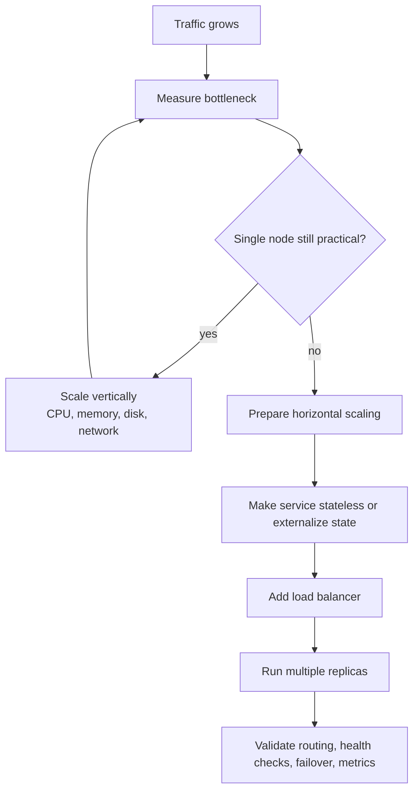
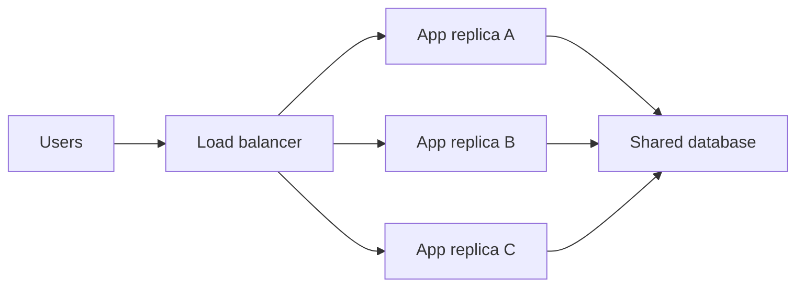

# Horizontal Scaling and Load Balancing Best Practices

## Purpose

Use this reference when a service is growing beyond the capacity of a single server and the team needs to decide how to scale it safely. Horizontal scaling is not just "add replicas and put a load balancer in front." It requires understanding capacity, state, routing, failure modes, network layers, balancing algorithms, and observability.

## Decision Summary

| Approach | Main Benefit | Main Limitation | Use When |
| -------- | ------------ | --------------- | -------- |
| Vertical scaling | Simple, fast, no distributed complexity | Hardware and cost ceiling; single point of failure remains | The service is not yet near vertical limits |
| Horizontal scaling | Adds capacity and redundancy through replicas | Requires load balancing, statelessness, shared state strategy, and operations discipline | One node cannot handle load or availability requirements |
| Layer 7 load balancing | HTTP-aware routing, headers, paths, methods, cookies | More protocol processing overhead | Web/API traffic needing route-aware behavior |
| Layer 4 load balancing | Fast TCP/UDP forwarding | Not HTTP-aware; less flexible for web routing | Raw TCP/UDP services or very high-throughput pass-through |

Default recommendation: scale vertically first when it is cheap and simple, then scale horizontally when capacity, availability, or redundancy requirements justify the added system complexity.

## When To Use

Use horizontal scaling when:

- a single server is approaching CPU, memory, network, or connection limits;
- downtime from one failed node is unacceptable;
- traffic spikes exceed one machine's practical capacity;
- vertical scaling is too expensive or has reached a hard ceiling;
- deployments need redundancy and rolling updates.

Avoid adding replicas prematurely when:

- the bottleneck is inefficient code or an unindexed database query;
- the service stores local state that cannot be shared or externalized;
- observability is too weak to know which layer is actually overloaded;
- a single stronger node would solve the problem with much less complexity.

## Scaling Path

## Recommended Practice

Start by measuring the actual bottleneck. A load balancer does not fix a slow database, a blocking dependency, a memory leak, or a bad query. It distributes incoming traffic across service instances.

Before scaling horizontally:

- make application instances disposable;
- move session state to cookies, a database, Redis, or another shared store;
- use external storage for uploaded files;
- ensure all replicas can serve the same request shape;
- add health checks;
- ensure logs and metrics identify the target instance;
- design deployments so instances can be added, removed, and restarted safely.

## Load Balancer Role

The load balancer receives client traffic and routes each request or connection to one backend instance. It should also remove unhealthy instances from rotation and allow capacity to be added without changing client-facing URLs.

## Layer 4 vs Layer 7

| Layer | Sees | Common Uses | Trade-off |
| ----- | ---- | ----------- | --------- |
| Layer 4 | IPs, ports, TCP/UDP connections | TCP services, pass-through load balancing, high throughput | Fast, but not aware of HTTP paths, headers, cookies, or status codes |
| Layer 7 | HTTP requests and responses | Web apps, APIs, path-based routing, host-based routing | More flexible, but more protocol processing |

For ordinary web applications and APIs, start with Layer 7 unless there is a clear reason for Layer 4. For long-lived connections or streaming, verify behavior with the real protocol and infrastructure path.

## Balancing Algorithms

| Algorithm | How It Works | Use When |
| --------- | ------------ | -------- |
| Round robin | Sends requests to backends in order | Backends have similar capacity and requests are similar cost |
| Weighted round robin | Sends more traffic to stronger backends | Instances have different sizes |
| Least connections | Sends traffic to the backend with fewer active connections | Requests or connections vary in duration |
| IP hash / consistent hash | Routes the same key to the same backend | Sticky routing is needed |
| Random / power of two choices | Picks from random candidates | Large pools where simple and effective distribution is enough |

Do not choose the algorithm only by familiarity. Match it to request duration, backend capacity, state requirements, and failure behavior.

## State And Stickiness

Horizontal scaling is easiest when the application is stateless. If a request requires local process state from a previous request, the load balancer may need sticky sessions, but that usually hides a design problem.

Prefer:

- stateless application servers;
- shared session storage;
- idempotent request handling;
- external queues for background work;
- shared caches with clear invalidation rules.

Use sticky sessions only when there is a deliberate reason, such as legacy migration, stateful protocols, or temporary compatibility. Sticky sessions reduce flexibility during failover and scaling.

## Validation

Validate before calling a system horizontally scalable:

- add and remove replicas while traffic is running;
- kill one replica and confirm traffic moves away from it;
- verify health checks are strict enough to detect broken instances;
- verify slow instances are not overloaded by the chosen algorithm;
- confirm logs show which backend handled each request;
- run load tests with realistic concurrency and request mix;
- verify deploys can roll without downtime;
- test behavior through the real load balancer, proxy, TLS, and DNS path.

## Anti-Patterns

| Anti-pattern | Problem | Alternative |
| ------------ | ------- | ----------- |
| Adding a load balancer before measuring bottlenecks | Complexity may not address the real problem | Measure CPU, memory, network, DB, latency, and dependency waits |
| Keeping session state in local memory | Requests fail or behave inconsistently across replicas | Externalize session state |
| No health checks | Broken instances continue receiving traffic | Add readiness and liveness checks |
| Treating replicas as backups only | Capacity and failover assumptions are untested | Actively route and test failover |
| Ignoring the database bottleneck | App replicas can overload one database | Optimize DB, cache, read replicas, queues, or shard when appropriate |
| Using Layer 4 for HTTP routing needs | Cannot route by path, host, header, or status behavior | Use Layer 7 |
| No connection draining | Deploys interrupt active users | Drain connections before shutdown |

## Checklist

- [ ] Measure the bottleneck before scaling.
- [ ] Try vertical scaling when it is the simplest sufficient move.
- [ ] Make the application stateless or externalize state.
- [ ] Add health checks.
- [ ] Choose Layer 4 or Layer 7 deliberately.
- [ ] Choose a balancing algorithm that matches request behavior.
- [ ] Validate failover.
- [ ] Validate rolling deploys.
- [ ] Monitor per-instance latency, errors, saturation, and traffic distribution.
- [ ] Re-check downstream bottlenecks after adding replicas.

## References

- [NGINX: HTTP Load Balancing](https://docs.nginx.com/nginx/admin-guide/load-balancer/http-load-balancer/)
- [NGINX: TCP and UDP Load Balancing](https://docs.nginx.com/nginx/admin-guide/load-balancer/tcp-udp-load-balancer/)
- [HAProxy Documentation](https://docs.haproxy.org/)
- [AWS Elastic Load Balancing Documentation](https://docs.aws.amazon.com/elasticloadbalancing/)

## Source Inspiration

This guide was inspired by:

- [YouTube video on horizontal scalability and load balancers](https://www.youtube.com/watch?v=hhy6EDDjy-o): the initial framing came from explaining vertical scaling first, then horizontal scaling, load balancer layers, routing algorithms, and practical load-balancer behavior.
