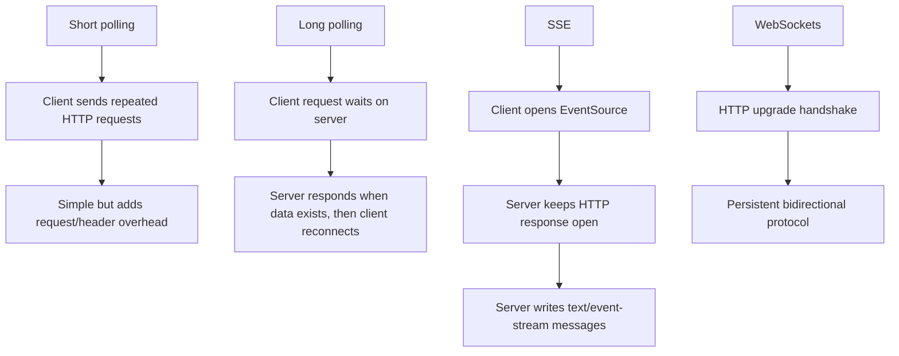
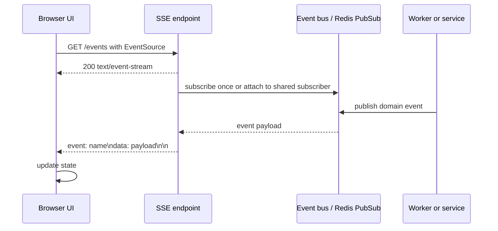
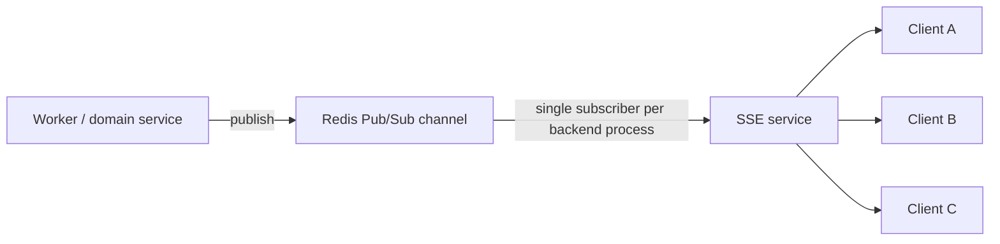

# Server-Sent Events Best Practices

## Purpose

Use this reference when a frontend needs near-real-time updates from a backend and the communication is primarily server-to-client. Server-Sent Events (SSE) are often a simpler default than WebSockets for notifications, progress updates, dashboards, AI token streaming, event logs, and read-only live feeds.

SSE is not a universal replacement for WebSockets. It is a good fit when the browser opens a long-lived HTTP request and the server streams text events over that response.

## Decision Summary

| Approach | Direction | Complexity | Use When |
| -------- | --------- | ---------- | -------- |
| Short polling | Client repeatedly asks server | Low | Simple internal dashboards, low traffic, loose freshness requirements |
| Long polling | Client request waits until data exists | Medium | Legacy environments where SSE is not available |
| Server-Sent Events | Server streams events to client over HTTP | Low-medium | Server-to-client updates, logs, notifications, progress, AI streaming |
| WebSockets | Bidirectional persistent connection | High | Chat, multiplayer, collaborative editing, low-latency bidirectional messaging, binary frames |

Default recommendation: prefer SSE when updates are one-way from server to browser and text-only. Use WebSockets when the client must continuously send messages back over the same persistent channel or when binary transport is required.

## When To Use

Use SSE when:

- the frontend mostly receives events from the server;
- text payloads are enough;
- automatic browser reconnection is useful;
- the application benefits from regular HTTP infrastructure;
- implementation simplicity matters;
- updates are event-like: progress, logs, notifications, status, locations, counters, token streams, or dashboard metrics.

Avoid SSE when:

- the client must send frequent real-time messages over the same channel;
- the payload is binary;
- the runtime or proxy stack cannot support long-lived HTTP responses;
- connection counts will exceed infrastructure limits without a fanout strategy;
- the application requires full-duplex semantics.

## Communication Patterns



## Recommended SSE Flow



The browser owns the SSE connection through `EventSource`. The backend keeps the response open and writes events as they happen. In distributed systems, a message bus such as Redis Pub/Sub can notify the SSE service when another service publishes an event.

## Event Stream Format

SSE responses must use `text/event-stream` and a line-oriented message format. Each event ends with a blank line.

Minimal event:

```text
data: hello

```

Named event:

```text
event: notification
data: {"message":"Order shipped"}

```

Useful fields:

| Field | Purpose |
| ----- | ------- |
| `data:` | Event payload. Required for useful messages. Multiple `data:` lines are joined by the client. |
| `event:` | Event name consumed by `addEventListener`. |
| `id:` | Event id used for reconnection and `Last-Event-ID`. |
| `retry:` | Client reconnection delay hint in milliseconds. |
| `:` | Comment line. Often used as heartbeat. |

Always terminate an event with two newline characters. If you end the HTTP response after each write, `EventSource` will reconnect and the implementation becomes accidental polling.

## Implementation Pattern

Browser:

```html
<script>
  const events = new EventSource("/events");

  events.addEventListener("notification", (event) => {
    const payload = JSON.parse(event.data);
    console.log(payload);
  });

  events.onerror = () => {
    console.warn("SSE connection lost; browser will retry automatically");
  };
</script>
```

Node/Express example:

```js
app.get("/events", (req, res) => {
  res.setHeader("Content-Type", "text/event-stream");
  res.setHeader("Cache-Control", "no-cache, no-transform");
  res.setHeader("Connection", "keep-alive");
  res.flushHeaders?.();

  const send = (eventName, payload) => {
    res.write(`event: ${eventName}\n`);
    res.write(`data: ${JSON.stringify(payload)}\n\n`);
  };

  send("connected", { ok: true });

  const interval = setInterval(() => {
    res.write(": heartbeat\n\n");
  }, 30000);

  req.on("close", () => {
    clearInterval(interval);
    res.end();
  });
});
```

Important details:

- Do not call `res.end()` after each event.
- Flush headers early when the framework buffers them.
- Disable proxy buffering where required.
- Send heartbeats to prevent idle timeouts.
- Clean up timers, listeners, subscriptions, and open resources when the client disconnects.

## Redis Pub/Sub Fanout Pattern

Do not open a new Redis connection for every connected browser. A naive implementation can create one Redis subscription per SSE client and overload Redis or the backend.

Prefer a shared subscriber per process, then fan out messages to connected clients in memory:



Sketch:

```js
const clients = new Set();

app.get("/events", (req, res) => {
  setupSseHeaders(res);
  clients.add(res);

  req.on("close", () => {
    clients.delete(res);
    res.end();
  });
});

redisSubscriber.subscribe("notifications", (message) => {
  for (const client of clients) {
    client.write(`event: notification\n`);
    client.write(`data: ${message}\n\n`);
  }
});
```

This pattern is simple, but it has operational limits. For large deployments, partition channels, enforce authorization, track connection counts, and consider a dedicated realtime gateway.

## Authentication And Authorization

Browser `EventSource` does not allow arbitrary custom request headers. That affects bearer-token patterns.

Common options:

- use same-origin cookies with secure, HTTP-only session handling;
- use a short-lived signed token in the query string;
- create a one-time stream token through a normal authenticated request, then open the SSE connection with that token;
- use a reverse proxy or backend-for-frontend that can attach identity server-side.

If using query-string tokens:

- make them short-lived;
- avoid sensitive payloads;
- avoid logging raw URLs;
- validate scope on the server;
- rotate or revoke when needed.

Always authorize the stream itself and every event payload. A connected client should only receive events it is allowed to see.

## Production Considerations

| Concern | Practice |
| ------- | -------- |
| Connection cleanup | Listen for `close` and remove client resources. |
| Heartbeats | Send comment events such as `: heartbeat\n\n` below infrastructure idle timeouts. |
| Proxy buffering | Disable buffering in proxies/CDNs that delay streaming. |
| Compression | Be careful: compression can buffer small chunks and delay delivery. |
| Backpressure | Track slow clients and disconnect when buffers grow too much. |
| Horizontal scaling | Use a bus, broker, or realtime gateway so events reach the correct process. |
| Sticky sessions | Avoid requiring them unless the architecture deliberately depends on process-local state. |
| Browser limits | Browsers limit concurrent connections per origin, especially under HTTP/1.1. |
| Observability | Track active connections, event rate, disconnects, errors, and stream duration. |
| Graceful shutdown | Stop accepting new streams and close existing streams cleanly during deploys. |

## Validation

Validate behavior in browser DevTools:

- there should be one long-lived request, not repeated requests every second;
- response headers should include `Content-Type: text/event-stream`;
- the EventStream view should show incoming events;
- closing the tab should close the backend stream;
- reconnects should happen when the connection drops;
- named events should reach the matching `addEventListener`.

Validate server behavior:

- connection count decreases after disconnect;
- Redis/database/client subscriptions are not created per browser unless explicitly intended;
- heartbeats keep streams alive through the actual proxy stack;
- authorization filters prevent cross-user or cross-tenant event leakage;
- memory usage remains stable under connect/disconnect churn;
- slow clients do not accumulate unbounded buffers.

## Anti-Patterns

| Anti-pattern | Problem | Alternative |
| ------------ | ------- | ----------- |
| Ending the response after every event | `EventSource` reconnects repeatedly, producing polling-like behavior | Keep the response open and write multiple events |
| One Redis connection per SSE client | Backend or Redis connection explosion | Shared subscriber plus in-process fanout |
| No `close` handler | Leaked timers, subscriptions, and response objects | Clean up on disconnect |
| Using SSE for bidirectional chat | Client-to-server path becomes awkward | Use WebSockets or separate POST commands plus SSE updates |
| Sending binary payloads | SSE is text-only | Use URLs, object storage, WebSockets, or normal downloads |
| No heartbeat | Idle proxies may close streams | Send comment heartbeats |
| Trusting frontend filtering | Event data may leak across users | Authorize stream and payloads server-side |
| Logging query-string tokens | Token exposure in logs | Prefer cookies or short-lived stream tokens and sanitize logs |

## Checklist

- [ ] Confirm communication is mostly server-to-client.
- [ ] Confirm text payloads are enough.
- [ ] Choose SSE, polling, long polling, or WebSockets deliberately.
- [ ] Set `Content-Type: text/event-stream`.
- [ ] Keep the response open.
- [ ] Format events with `data:` and a blank line terminator.
- [ ] Use named events when multiple event types exist.
- [ ] Add heartbeats.
- [ ] Clean up on client disconnect.
- [ ] Avoid one external resource connection per browser stream.
- [ ] Authorize the stream and each event scope.
- [ ] Validate through the real proxy/load balancer/CDN path.
- [ ] Monitor active connections, event rate, errors, and memory usage.

## References

- [MDN: Using server-sent events](https://developer.mozilla.org/en-US/docs/Web/API/Server-sent_events/Using_server-sent_events)
- [MDN: EventSource](https://developer.mozilla.org/en-US/docs/Web/API/EventSource)
- [HTML Living Standard: Server-sent events](https://html.spec.whatwg.org/multipage/server-sent-events.html)
- [Redis docs: Pub/Sub](https://redis.io/docs/latest/develop/pubsub/)

## Source Inspiration

This guide was inspired by:

- [YouTube video on Server-Sent Events and realtime communication](https://www.youtube.com/watch?v=uiT4oK19hu4): the initial framing came from comparing polling, long polling, SSE, and WebSockets, then connecting SSE to Redis Pub/Sub fanout and connection-management concerns.
