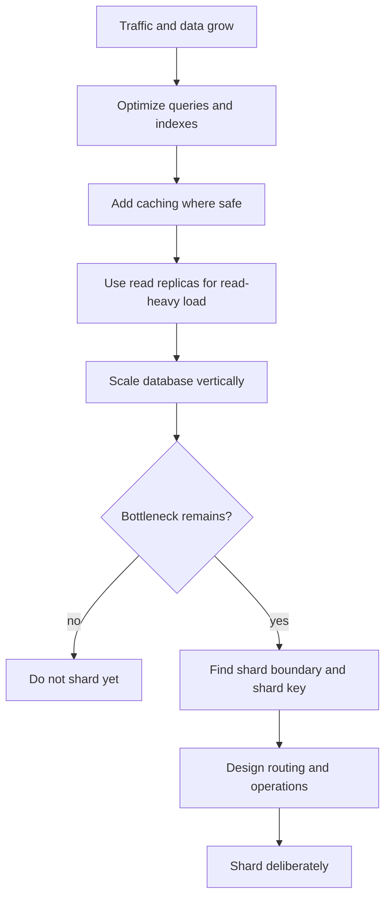
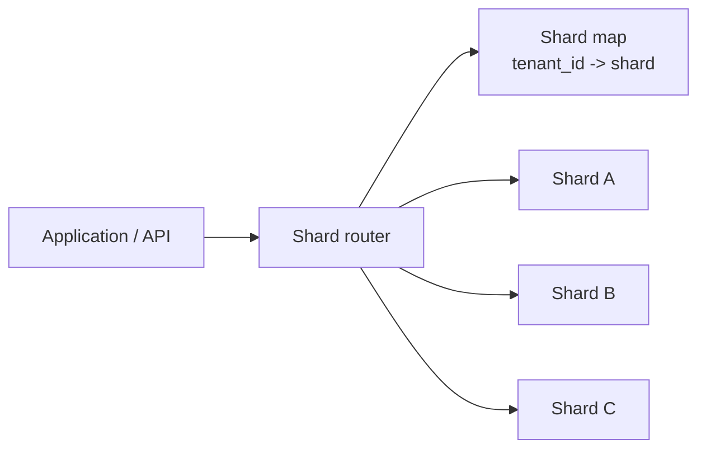
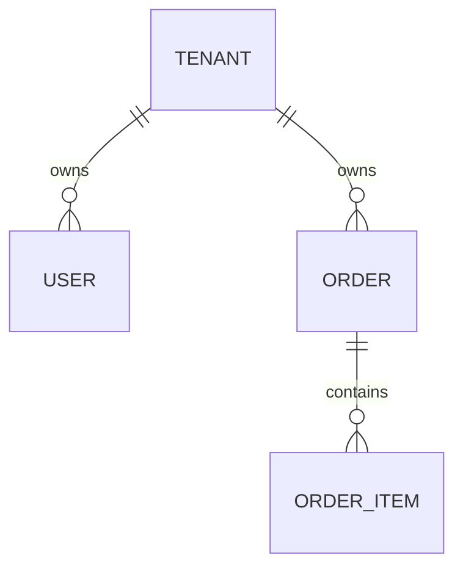

# Database Sharding Best Practices

## Purpose

Use this reference when a database has outgrown vertical scaling, query optimization, caching, and read replicas, and the team is considering horizontal database scaling through sharding.

Sharding splits data across multiple independent database nodes. It can unlock scale, but it also adds routing, consistency, operational, and modeling complexity. Treat it as a late-stage scaling strategy, not a default architecture.

## Decision Summary

| Approach | Solves | Does Not Solve | Use When |
| -------- | ------ | -------------- | -------- |
| Vertical database scaling | More CPU, memory, IOPS, storage | Hard hardware/cost ceiling; single-node limits | The database can still scale up economically |
| Index/query optimization | Slow reads and inefficient plans | Total dataset or write throughput limits | Queries are inefficient or missing indexes |
| Cache | Repeated expensive reads | Write throughput, cache invalidation complexity | Workload has hot repeated reads |
| Read replicas | Read throughput | Write throughput, storage growth, cross-region consistency | Reads dominate and eventual consistency is acceptable |
| Sharding | Dataset size, write throughput, tenant/user partition scale | Cross-shard joins, distributed transactions, operational complexity | One database cannot practically handle data volume or write load |

Default recommendation: exhaust simpler options first. Shard only when a clear scaling limit remains and the data model has a strong partition key.

## When To Use

Consider sharding when:

- one database can no longer handle write throughput;
- data volume exceeds practical storage or maintenance limits for one node;
- one tenant/customer/user group can be isolated naturally;
- operational work such as backup, restore, vacuum, index rebuilds, or migrations is too large for one database;
- read replicas and caching do not address the bottleneck.

Avoid sharding when:

- the bottleneck is missing indexes or bad queries;
- the system is a large, tightly coupled monolith with hundreds of cross-cutting tables;
- the main entity boundary is unclear;
- most queries require joins across the entire dataset;
- the team cannot operate routing, migrations, rebalancing, and monitoring.

## Scaling Path

## Recommended Practice

Choose a shard key that keeps related data together and distributes load evenly. The shard key is the most important design decision because it determines routing, query shape, hotspots, rebalancing, and whether the system remains understandable.

Good shard keys usually:

- appear in most high-volume queries;
- map to a strong business boundary, such as tenant, customer, account, region, or user;
- distribute writes and storage reasonably evenly;
- minimize cross-shard joins and transactions;
- remain stable over time.

Poor shard keys usually:

- create hot shards;
- require many queries to scatter across all shards;
- change frequently;
- depend on low-cardinality values such as status or country when traffic is uneven;
- split strongly related data across shards.

## Sharding Models

| Model | How It Works | Trade-off |
| ----- | ------------ | --------- |
| Range sharding | Routes by value ranges, such as ID or date ranges | Easy to reason about, but can create hotspots |
| Hash sharding | Hashes the shard key to choose a shard | Good distribution, harder range queries and rebalancing |
| Directory-based sharding | Lookup table maps key to shard | Flexible, but routing metadata becomes critical infrastructure |
| Tenant-based sharding | Each tenant or tenant group maps to a shard | Strong isolation, but tenant size skew must be handled |
| Geo sharding | Data routes by region | Good locality/compliance, but cross-region queries are harder |

## Routing Pattern

The application must know how to route each request to the correct shard. That routing can live in application code, a data access layer, a shard router service, a proxy, or a database platform that supports sharding.

Keep routing deterministic and observable. Every query should make it clear whether it targets one shard or fans out to many shards.

## Data Modeling Rules

Prefer colocating data that is read and written together:

If the shard key is `tenant_id`, then `users`, `orders`, and `order_items` should usually carry `tenant_id` or be reachable within the same tenant shard. That keeps common queries local.

Avoid designs where core workflows require joining data across shards. Cross-shard operations should be rare, explicit, and designed as distributed workflows rather than hidden behind ordinary ORM calls.

## Cross-Shard Operations

Cross-shard queries are expensive and operationally complex. Common strategies:

- duplicate small reference data on every shard;
- maintain global lookup tables for routing;
- use asynchronous workflows for cross-shard aggregation;
- export data to analytics systems for global reporting;
- design APIs around shard-local operations;
- use sagas or compensating actions instead of distributed transactions when possible.

Be explicit about consistency. Sharded systems often trade immediate global consistency for scale and availability.

## Rebalancing And Growth

Sharding is not finished when the first shard split works. Plan for:

- adding new shards;
- moving tenants or key ranges;
- splitting hot shards;
- merging small shards;
- rebuilding indexes per shard;
- running migrations across all shards;
- backup and restore per shard;
- detecting skew before it becomes an incident.

Hot shards are one of the most common failure modes. Even when total traffic looks balanced, one large tenant or celebrity user can overload a single shard.

## Monolith Warning

Do not start by sharding a large tightly coupled monolith. If hundreds of tables share unclear boundaries, sharding a few tables can leave the rest duplicated everywhere and make the system harder to reason about.

Before sharding, identify bounded contexts and data ownership. In many systems, the correct first move is to split the domain or service boundary, then shard the database inside the bounded context that actually needs it.

## Validation

Validate the sharding design before implementation:

- list top read and write queries and identify their shard key;
- estimate distribution of data and traffic by shard key;
- simulate large tenants or hot keys;
- verify whether core workflows remain shard-local;
- identify every cross-shard query and transaction;
- define backup, restore, migration, and rebalancing procedures;
- measure routing latency and failure behavior;
- test adding and removing shards in a non-production environment.

## Anti-Patterns

| Anti-pattern | Problem | Alternative |
| ------------ | ------- | ----------- |
| Sharding before indexing/query optimization | Adds complexity without fixing simple bottlenecks | Optimize, cache, replicate, and scale vertically first |
| Choosing a low-cardinality shard key | Creates uneven shards | Use a high-cardinality, workload-aligned key |
| Hidden scatter-gather queries | Latency and cost explode with shard count | Make fanout explicit and rare |
| Cross-shard joins in core paths | Slow and hard to keep consistent | Colocate related data by shard key |
| No shard map ownership | Routing becomes unreliable | Treat shard metadata as critical infrastructure |
| No rebalancing plan | Growth eventually creates hot shards | Design split/move workflows early |
| Sharding a huge monolith blindly | Boundaries are unclear and duplicated tables spread everywhere | Split bounded contexts first |
| Treating read replicas as sharding | Replicas help reads, not write partitioning | Use replicas for reads; shard for partitioned writes/data |

## Checklist

- [ ] Confirm the bottleneck remains after indexes, query tuning, caching, read replicas, and vertical scaling.
- [ ] Identify the main entity or ownership boundary.
- [ ] Choose a high-cardinality shard key.
- [ ] Verify top queries are shard-local.
- [ ] Identify cross-shard workflows.
- [ ] Decide routing ownership.
- [ ] Design shard map storage and failure behavior.
- [ ] Plan migrations across shards.
- [ ] Plan backup and restore per shard.
- [ ] Plan rebalancing and hot-shard mitigation.
- [ ] Add shard-aware observability.
- [ ] Test with production-like data distribution.

## References

- [MongoDB Manual: Sharding](https://www.mongodb.com/docs/manual/sharding/)
- [Vitess Documentation](https://vitess.io/docs/)
- [PostgreSQL Documentation: Table Partitioning](https://www.postgresql.org/docs/current/ddl-partitioning.html)
- [CockroachDB Docs: Multi-region Capabilities](https://www.cockroachlabs.com/docs/stable/multiregion-overview)

## Source Inspiration

This guide was inspired by:

- [YouTube video on database sharding and horizontal database scaling](https://www.youtube.com/watch?v=xJllDyCIyws): the initial framing came from walking through growth bottlenecks, vertical scaling, indexes, caching, read replicas, shard keys, and the warning against blindly sharding large monoliths.
