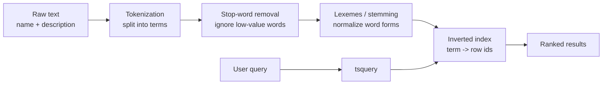
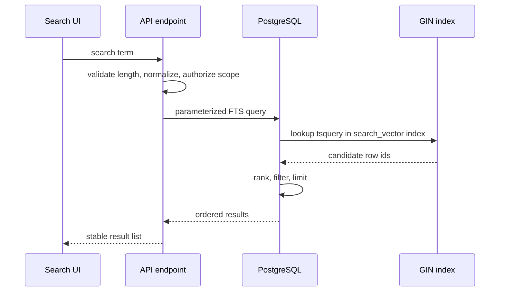

# PostgreSQL Text Search Best Practices

## Purpose

Use this reference when implementing user-facing search in PostgreSQL. It covers why substring search with `LIKE`/`ILIKE` is usually the wrong default, how PostgreSQL Full Text Search works, when to add `pg_trgm`, which indexes are required, and how to validate performance and relevance.

This guide focuses on PostgreSQL. MySQL Full Text Search has similar high-level goals, but PostgreSQL provides stronger language configuration, lexemes/stemming, thesaurus support, ranking control, field weighting, and tokenization customization.

## Decision Summary

| Approach | Relevance | Scale | Use When |
| -------- | --------- | ----- | -------- |
| `LIKE '%term%'` / `ILIKE '%term%'` | Low | Poor; usually scans many rows | One-off admin filters, diagnostics, tiny datasets |
| `ILIKE 'term%'` | Medium | Acceptable with the right index on small columns | Simple prefix autocomplete |
| Full Text Search (FTS) | High | Good with a GIN index over `tsvector` | User searches over names, descriptions, articles, or long text |
| `pg_trgm` + GIN | Medium-high | Good with a trigram GIN index | Proper names, emails, codes, identifiers, typos, partial terms |
| FTS + `pg_trgm` | High | Good with careful query design | Rich search that needs both linguistic ranking and typo tolerance |

Default recommendation: do not expose `LIKE '%...%'` as the primary mechanism for user search. Prefer FTS or `pg_trgm`, and create the index before shipping the feature.

## When To Use

Use FTS when:

- users search for words in natural language;
- term order should be flexible;
- relevance ranking matters;
- plural/singular, stop words, and language rules should affect matching;
- the searched table can grow or receive frequent concurrent queries.

Use `pg_trgm` when:

- users may type with errors;
- the field is short or identifier-like, such as a name, email, domain, or document number;
- partial similarity is more important than linguistic analysis;
- FTS fails because the searched value is not natural language.

Use equality, prefix search, or B-tree indexes when:

- the lookup is exact;
- the prefix is explicit and short;
- there is no need for textual ranking.

## Why `LIKE` Fails As User Search

`LIKE` compares character sequences, not words. Wildcards on both sides amplify false positives:

```sql
SELECT name
FROM users
WHERE name ILIKE '%ana%';
```

This can match `Ana`, `Adriana`, `Luciana`, `Vanessa`, and `Mariana`. It does not understand word boundaries, compound searches, synonyms, plural/singular forms, spelling variants, or relevance.

Prefix search reduces some false positives but does not solve the core problem:

```sql
SELECT name
FROM products
WHERE name ILIKE 'cap%';
```

This may match `cap`, `cap cover`, and `helmet` terms such as `capacete` in Portuguese-like datasets. It still searches characters, not meaning.

Compound searches are another failure mode. A user searching for `silver ring` usually expects records that contain both concepts, possibly in different fields or in a different order. Plain substring search often requires the exact phrase shape.

## Performance Failure Mode

Without a usable index, the planner must inspect row by row:

```sql
EXPLAIN (ANALYZE, BUFFERS)
SELECT *
FROM products
WHERE name ILIKE '%ring%';
```

Warning signs:

| Indicator | Meaning |
| --------- | ------- |
| `Seq Scan` | PostgreSQL scanned the table row by row |
| Many rows removed by filter | The predicate did not narrow through an index |
| High CPU time | Text comparison happened repeatedly |
| Many buffers read | Query cost grows with table size |

With 10,000 rows and 100 concurrent users, naive substring search can force the database to inspect about 1,000,000 row candidates. The exact cost depends on caching, hardware, row width, and predicates, but the growth pattern is the problem: work increases with table size and concurrent demand.

## How Full Text Search Works

FTS treats text as searchable vocabulary instead of raw strings.



The important structure is the inverted index: instead of scanning every product looking for `ring`, PostgreSQL can consult an index entry that already knows which rows contain that lexeme.

Core PostgreSQL types:

| Type | Role |
| ---- | ---- |
| `tsvector` | Indexed document containing lexemes and positions |
| `tsquery` | Search query containing terms and operators |

Basic test query:

```sql
SELECT *
FROM products
WHERE to_tsvector('english', coalesce(name, '') || ' ' || coalesce(description, ''))
      @@ plainto_tsquery('english', 'silver ring');
```

Useful functions:

| Function | Use |
| -------- | --- |
| `to_tsvector(config, text)` | Convert text into lexemes |
| `plainto_tsquery(config, term)` | Safely interpret user text as terms joined by AND |
| `websearch_to_tsquery(config, term)` | Accept search-engine-like syntax such as quotes and exclusions |
| `to_tsquery(config, expression)` | Use explicit operators; only for controlled or sanitized input |
| `ts_rank(tsvector, tsquery)` | Compute relevance |
| `ts_rank_cd(tsvector, tsquery)` | Rank with coverage/proximity considerations |

Prefer `plainto_tsquery` or `websearch_to_tsquery` for raw user input. Use `to_tsquery` when the application controls the expression syntax.

## Lexemes, Language, And Stemming

PostgreSQL language configurations normalize related terms into lexemes:

```sql
SELECT to_tsvector('english', 'programmer programming programmed programs');
```

The result groups related word forms under shared lexical roots. In Portuguese, terms such as plural/singular forms or related variants can also normalize according to the selected dictionary.

Inspect indexed lexemes when relevance is surprising:

```sql
SELECT id, name, to_tsvector('english', name) AS lexemes
FROM products
LIMIT 20;
```

Use the language configuration that matches the content. For mixed-language content, choose deliberately: a single language config may help one language and distort another.

## Recommended FTS Pattern

Use a generated `tsvector` column and a GIN index:

```sql
ALTER TABLE products
  ADD COLUMN search_vector tsvector
  GENERATED ALWAYS AS (
    setweight(to_tsvector('english', coalesce(name, '')), 'A')
    || setweight(to_tsvector('english', coalesce(description, '')), 'B')
  ) STORED;

CREATE INDEX idx_products_search_vector
  ON products USING gin (search_vector);
```

Query with ranking:

```sql
SELECT p.id, p.name, ts_rank(p.search_vector, q.query) AS rank
FROM products p
CROSS JOIN plainto_tsquery('english', $1) AS q(query)
WHERE p.search_vector @@ q.query
ORDER BY rank DESC, p.id ASC
LIMIT 50;
```

Use weights (`A` to `D`) to make names or titles matter more than long descriptions.

Expression indexes can work too:

```sql
CREATE INDEX idx_products_fts
  ON products USING gin (
    to_tsvector('english', coalesce(name, '') || ' ' || coalesce(description, ''))
  );
```

Prefer generated columns when ranking, debugging, or repeated query patterns need direct access to the vector.

Important: FTS without an index may be slower than `LIKE` because PostgreSQL has to build the `tsvector` during the query. Do not treat `to_tsvector(...)` in `WHERE` as production-ready unless the matching expression is indexed and the plan confirms index usage.

## Search Flow



## `pg_trgm` For Fuzzy Search

Enable the extension and create a GIN index:

```sql
CREATE EXTENSION IF NOT EXISTS pg_trgm;

CREATE INDEX idx_contacts_name_trgm
  ON contacts USING gin (lower(name) gin_trgm_ops)
  WHERE name IS NOT NULL;
```

Query by similarity:

```sql
SELECT id, name, similarity(lower(name), lower($1)) AS score
FROM contacts
WHERE lower(name) % lower($1)
ORDER BY score DESC, id ASC
LIMIT 50;
```

The `%` operator uses PostgreSQL's trigram similarity threshold and can use the GIN index. Tune thresholds carefully and measure the plan.

Avoid adding broad `OR similarity(...) >= ...` predicates without measuring. Depending on the expression, they can reduce index effectiveness and reintroduce expensive scans.

## Structured Filters First

Search queries usually combine text with structured constraints. Apply scope and selective filters before ranking:

1. restrict by tenant, authorization, status, category, dates, or flags;
2. apply FTS or trigram matching on the eligible subset;
3. order by score plus deterministic tie-breakers;
4. limit results and paginate predictably.

```sql
WITH query AS (
  SELECT plainto_tsquery('english', $1) AS q
)
SELECT p.id, p.name, ts_rank(p.search_vector, query.q) AS rank
FROM products p
CROSS JOIN query
WHERE p.status = 'active'
  AND p.search_vector @@ query.q
ORDER BY rank DESC, p.id ASC
LIMIT 50;
```

For multi-tenant or permissioned systems, the search result set must be scoped before returning data. Do not rely on frontend filtering for security.

## Synonyms And Thesaurus

FTS does not automatically know every domain synonym. If users search for `car` and records use `vehicle`, or users search for `ring` and records use `wedding band`, model that explicitly.

Options:

- configure a PostgreSQL thesaurus dictionary for stable domain synonyms;
- maintain an application-level synonym expansion layer;
- add curated synonym fields to the indexed text;
- combine FTS with embedding search when semantic matching is required.

Use thesaurus configuration when the vocabulary is stable and operational ownership is clear. Use application-level expansion when synonyms change frequently or differ by tenant/product.

## Security And API Design

- Never concatenate user input into dynamic SQL.
- Parameterize search terms.
- Set a minimum term length for expensive or public searches.
- Rate-limit public or high-volume endpoints.
- Set a stable `search_path` in database functions exposed to applications.
- Keep authorization and tenant isolation explicit.
- Return a bounded result set.
- Log slow searches with enough metadata to debug term length, selected filters, and plan regressions.

## Validation

Validate with representative data:

```sql
EXPLAIN (ANALYZE, BUFFERS)
SELECT p.name
FROM products p
CROSS JOIN plainto_tsquery('english', 'silver ring') AS q(query)
WHERE p.search_vector @@ q.query
ORDER BY ts_rank(p.search_vector, q.query) DESC
LIMIT 50;
```

Look for:

| Expected | Avoid |
| -------- | ----- |
| `Bitmap Index Scan` or clear GIN index usage | `Seq Scan` on large tables |
| low buffer reads | repeated full-table scans |
| stable latency as data grows | latency proportional to total rows |
| relevant first-page results | substring-only ordering |
| deterministic tie-breakers | unstable ordering between equal ranks |

Test:

- empty terms;
- 1-character terms;
- casing and accents;
- multiple words;
- typos when using `pg_trgm`;
- null fields;
- tenant and authorization boundaries;
- tied scores;
- pagination consistency;
- production-like row counts.

## Anti-Patterns

| Anti-pattern | Problem | Alternative |
| ------------ | ------- | ----------- |
| `WHERE column LIKE '%' || $1 || '%'` | Low relevance and broad scans | FTS or `pg_trgm` with GIN |
| `to_tsvector(...)` in `WHERE` without an index | Runtime tokenization for many rows | Generated column + GIN index |
| `to_tsquery` with raw user input | Special characters can break or alter the query | `plainto_tsquery` or `websearch_to_tsquery` |
| Text search before authorization/scope filters | Extra work and possible logical leakage | Scope first, then search |
| No result limit | Unpredictable latency and payload size | `LIMIT`, pagination, stable ordering |
| Shipping search before index creation | Production performance incident | Migration before feature release |
| Treating FTS as semantic search | Synonyms and meaning may be missed | Thesaurus, synonym expansion, or embeddings |

## Checklist

- [ ] Classify the search: word search, prefix, similarity, exact match, or semantic.
- [ ] Choose FTS, `pg_trgm`, B-tree, synonym expansion, embeddings, or a combination.
- [ ] Define searchable columns and field weights.
- [ ] Choose the correct language configuration.
- [ ] Create indexes before exposing the feature.
- [ ] Parameterize user input.
- [ ] Handle empty and short terms.
- [ ] Apply authorization and scope filters.
- [ ] Define `LIMIT`, pagination, and stable ordering.
- [ ] Validate with `EXPLAIN (ANALYZE, BUFFERS)`.
- [ ] Test relevance with real search examples, typos, casing, accents, and tied scores.
- [ ] Monitor slow searches after release.

## References

- [PostgreSQL: Text Search Types](https://www.postgresql.org/docs/current/datatype-textsearch.html)
- [PostgreSQL: Full Text Search](https://www.postgresql.org/docs/current/textsearch.html)
- [PostgreSQL: `pg_trgm`](https://www.postgresql.org/docs/current/pgtrgm.html)
- [PostgreSQL: GIN indexes](https://www.postgresql.org/docs/current/gin.html)

## Source Inspiration

This guide was inspired by:

- [YouTube video on Full Text Search and database search practices](https://www.youtube.com/watch?v=UYOr-rpQs1I): the initial framing came from the contrast between naive `LIKE` queries, inverted indexes, relevance ranking, and PostgreSQL Full Text Search.
