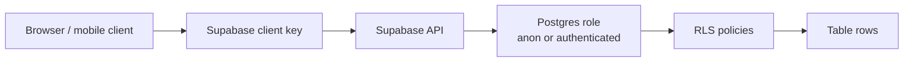
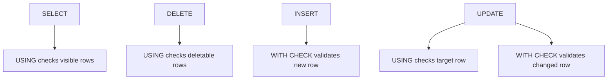
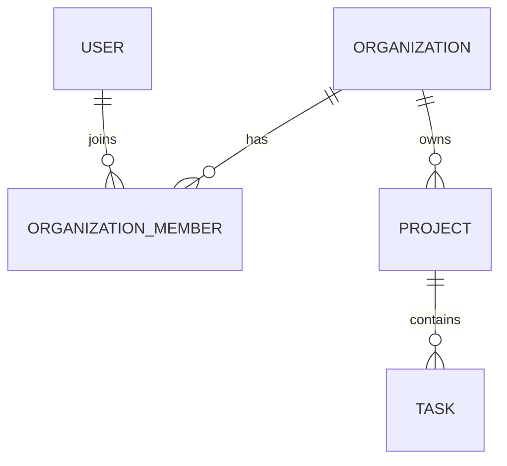

# Supabase Row Level Security Best Practices

## Purpose

Use this reference when building or reviewing a Supabase application where client code can query the database directly. In Supabase, Row Level Security (RLS) is not an optional hardening layer. It is the authorization boundary that decides which rows each request can read or modify.

This is especially important for AI-assisted or "vibe-coded" applications. Agents can generate working Supabase queries quickly, but they often miss the security model: tables in exposed schemas must have RLS enabled, policies must match the real ownership model, and privileged keys/functions must not bypass authorization accidentally.

## Decision Summary

| Topic | Default Practice | Risk If Ignored |
| ----- | ---------------- | --------------- |
| Exposed tables | Enable RLS on every table in exposed schemas | Browser/API clients may access data too broadly |
| Policy design | Write one explicit policy per operation and role | Accidental read/write paths or confusing behavior |
| `USING` vs `WITH CHECK` | Use `USING` for existing rows and `WITH CHECK` for new row state | Users may update or insert rows outside their scope |
| Roles | Use `TO authenticated` / `TO anon` explicitly | Policies run for unintended roles |
| Ownership | Store stable ownership fields such as `user_id`, `tenant_id`, or `organization_id` | Access rules become ambiguous |
| JWT claims | Use trusted claims from `raw_app_meta_data`; avoid authorization from user-editable metadata | Users may influence their own permissions |
| Functions/views | Prefer `security invoker`; lock down `security definer` | RLS bypasses and privilege escalation |
| Performance | Index policy columns and benchmark policies | Secure queries become too slow to use |
| Storage | Treat `storage.objects` policies as part of the app security model | Files can be listed, read, overwritten, or deleted incorrectly |

Default recommendation: enable RLS early, design policies from the data ownership model, test as `anon` and `authenticated`, and never rely on frontend checks as the authorization boundary.

## When To Use

Use this guide when:

- a Supabase project exposes database tables through the generated API;
- frontend code uses the Supabase client directly;
- users should only access their own rows, organization rows, team rows, or role-scoped rows;
- Supabase Storage buckets need per-user or per-tenant access control;
- database functions, RPCs, or views are exposed to client roles;
- an AI agent generated schema, queries, policies, or migrations that need security review.

This guide is less relevant when all database access goes through a trusted backend with its own authorization layer and the database is not exposed to client roles. Even then, RLS can still provide defense in depth.

## Mental Model

Supabase maps API requests to PostgreSQL roles such as `anon` and `authenticated`. Policies are attached to tables and act like authorization predicates that PostgreSQL applies to queries.



Think of RLS as a `WHERE` clause and a write constraint controlled by the database:

- `USING` controls which existing rows are visible or targetable by `SELECT`, `UPDATE`, and `DELETE`.
- `WITH CHECK` controls whether new row values from `INSERT` or `UPDATE` are allowed.
- If RLS is enabled and no applicable policy exists, access is denied by default.

## Recommended Policy Baseline

Start with explicit ownership columns:

```sql
create table public.documents (
  id uuid primary key default gen_random_uuid(),
  owner_id uuid not null references auth.users(id),
  title text not null,
  body text,
  created_at timestamptz not null default now()
);

alter table public.documents enable row level security;
```

Create operation-specific policies:

```sql
create policy "Users can read their own documents"
on public.documents
for select
to authenticated
using (
  (select auth.uid()) is not null
  and owner_id = (select auth.uid())
);

create policy "Users can create their own documents"
on public.documents
for insert
to authenticated
with check (
  owner_id = (select auth.uid())
);

create policy "Users can update their own documents"
on public.documents
for update
to authenticated
using (
  owner_id = (select auth.uid())
)
with check (
  owner_id = (select auth.uid())
);

create policy "Users can delete their own documents"
on public.documents
for delete
to authenticated
using (
  owner_id = (select auth.uid())
);
```

Add indexes for policy predicates:

```sql
create index idx_documents_owner_id
  on public.documents(owner_id);
```

## `USING` vs `WITH CHECK`

Use `USING` to decide whether an existing row can be seen, updated, or deleted. Use `WITH CHECK` to decide whether a newly inserted or updated row is allowed to exist after the operation.



For `UPDATE`, use both. Without `WITH CHECK`, a user may be able to move a row into a state they should not control, depending on the policy shape.

## Multi-Tenant Pattern

For organization-scoped applications, model membership explicitly and keep policies tied to `organization_id` or `tenant_id`.



Example:

```sql
create table public.organization_members (
  organization_id uuid not null,
  user_id uuid not null references auth.users(id),
  role text not null,
  primary key (organization_id, user_id)
);

create table public.projects (
  id uuid primary key default gen_random_uuid(),
  organization_id uuid not null,
  name text not null
);

alter table public.organization_members enable row level security;
alter table public.projects enable row level security;

create policy "Members can read organization projects"
on public.projects
for select
to authenticated
using (
  exists (
    select 1
    from public.organization_members m
    where m.organization_id = projects.organization_id
      and m.user_id = (select auth.uid())
  )
);
```

For high-volume tables, benchmark this shape. Joins inside policies can become expensive. If the membership lookup is stable and reused, consider indexes, precomputed access tables, trusted JWT claims, or carefully written security-definer helper functions.

## Roles And JWT Claims

Use `TO authenticated` and `TO anon` explicitly. It avoids running policies for roles that should not use them and makes intent obvious during review.

Use `auth.uid()` for the authenticated user id. Remember that unauthenticated requests return `null`, so explicit checks can make policy intent clearer:

```sql
using (
  (select auth.uid()) is not null
  and owner_id = (select auth.uid())
)
```

Use `auth.jwt()` carefully:

- `raw_user_meta_data` can be updated by users and should not drive authorization.
- `raw_app_meta_data` is controlled by the server side and is better suited for authorization claims.
- JWT claims may be stale until the token is refreshed.
- Claims are useful for coarse roles and stable permissions, not rapidly changing access lists.

## RBAC Pattern

For role-based access control, prefer a small authorization function that centralizes permission checks:

```sql
create type public.app_permission as enum (
  'projects.read',
  'projects.update'
);

create or replace function public.authorize(requested_permission public.app_permission)
returns boolean
language plpgsql
stable
security invoker
set search_path = ''
as $$
declare
  user_role text;
begin
  select auth.jwt() ->> 'user_role' into user_role;

  return exists (
    select 1
    from public.role_permissions rp
    where rp.role = user_role
      and rp.permission = requested_permission
  );
end;
$$;
```

Then use it in policies:

```sql
create policy "Authorized users can read projects"
on public.projects
for select
to authenticated
using (
  public.authorize('projects.read')
);
```

If a function needs elevated access, use `security definer` only with a narrow purpose, explicit privileges, a locked `search_path`, and a non-exposed schema when possible.

## Views, Functions, And RPCs

Views and functions are common RLS escape hatches. Review them carefully.

Rules:

- Prefer `security invoker`, which uses the caller's privileges.
- If using `security definer`, set `search_path` explicitly.
- Do not put privileged helper functions in exposed schemas unless they must be callable.
- Revoke default function execution from `public`, `anon`, and `authenticated` when functions are not meant to be public.
- In PostgreSQL 15+, use `security_invoker = true` for views that should obey the invoking role's RLS behavior.
- In older PostgreSQL versions, protect views by revoking access or placing them in unexposed schemas.

Safer function skeleton:

```sql
create or replace function private.has_project_access(project_id uuid)
returns boolean
language sql
stable
security definer
set search_path = ''
as $$
  select exists (
    select 1
    from public.projects p
    join public.organization_members m
      on m.organization_id = p.organization_id
    where p.id = project_id
      and m.user_id = auth.uid()
  );
$$;

revoke execute on function private.has_project_access(uuid) from public;
```

## Storage Policies

Supabase Storage access is controlled through RLS policies on `storage.objects`. Treat file access as part of the same authorization model as table data.

Example owner-scoped object policy:

```sql
create policy "Users can read their own files"
on storage.objects
for select
to authenticated
using (
  owner_id = (select auth.uid()::text)
);
```

Bucket and path policies should be explicit:

```sql
create policy "Users can upload avatars"
on storage.objects
for insert
to authenticated
with check (
  bucket_id = 'avatars'
  and owner_id = (select auth.uid()::text)
);
```

Do not assume bucket ownership alone enforces access. Write policies for listing, reading, uploading, overwriting, and deleting according to the actual product behavior.

## Performance Practices

RLS policies run as part of queries. A secure policy can still be unusable if it forces repeated scans.

Prefer:

- indexes on columns referenced in policies, such as `owner_id`, `user_id`, `tenant_id`, `organization_id`, and join keys;
- `(select auth.uid())` rather than repeated direct function calls in row predicates when appropriate;
- explicit `TO authenticated` or `TO anon`;
- avoiding joins that run per row on large tables;
- security-definer helper functions only when they reduce policy cost without expanding privileges unsafely;
- representative benchmarks with RLS enabled.

Validation query:

```sql
explain (analyze, buffers)
select *
from public.documents
where owner_id = auth.uid()
order by created_at desc
limit 50;
```

Compare plans with realistic data. If testing whether RLS is the bottleneck, only disable RLS in a non-production environment.

## AI-Assisted Development Risks

AI-generated Supabase code often fails in predictable ways:

- creates tables in `public` without enabling RLS;
- writes frontend queries that work only because broad policies exist;
- uses the `service_role` key in client-side code;
- creates `using (true)` policies to unblock the UI;
- forgets `WITH CHECK` for inserts or updates;
- relies on user-editable metadata for roles;
- creates views or functions that bypass RLS accidentally;
- tests only with the table editor or privileged SQL editor;
- does not test as `anon` and `authenticated`.

When reviewing AI-generated Supabase work, inspect schema, policies, grants, functions, views, storage buckets, and environment variables before trusting the UI behavior.

## Validation

Validate access with role-specific tests:

- unauthenticated user cannot access protected rows;
- authenticated user can access their own rows;
- authenticated user cannot access another user's rows;
- organization member can access organization rows;
- non-member cannot access organization rows;
- insert rejects forged `owner_id` or `organization_id`;
- update cannot transfer ownership to another user or tenant;
- delete only affects authorized rows;
- storage list/read/upload/delete behavior matches the product rules;
- exposed functions and views do not bypass policies unintentionally.

Use Supabase's Security Advisor and Performance Advisor as a review surface, but do not treat advisor checks as a replacement for tests.

## Anti-Patterns

| Anti-pattern | Problem | Alternative |
| ------------ | ------- | ----------- |
| RLS disabled on exposed tables | Client-accessible data may be exposed | Enable RLS and define explicit policies |
| Broad `using (true)` policies | Turns RLS into a formality | Scope by role, ownership, tenant, or permission |
| Missing `WITH CHECK` | Users may insert or update rows outside their scope | Add write constraints for new row state |
| `service_role` in frontend code | Complete RLS bypass from the client | Use publishable/anon keys in clients; keep service role server-side |
| Authorization from `raw_user_meta_data` | Users can modify their own metadata | Use server-controlled claims or database membership tables |
| No explicit `TO` clause | Policy applies more broadly than intended | Use `TO authenticated` / `TO anon` |
| Unindexed policy predicates | Secure queries become slow | Index ownership and membership columns |
| Privileged `security definer` in exposed schema | Accidental privilege escalation | Put helpers in private schemas, revoke execution, set `search_path` |
| Views assumed to respect RLS | Views may execute with owner privileges | Use `security_invoker = true` or restrict access |
| Testing only as admin | RLS behavior is not exercised | Test with real `anon` and `authenticated` clients |

## Checklist

- [ ] Enable RLS on every table in exposed schemas.
- [ ] Define policies for each operation: `SELECT`, `INSERT`, `UPDATE`, `DELETE`.
- [ ] Use `TO authenticated` and/or `TO anon` explicitly.
- [ ] Use `USING` for existing rows.
- [ ] Use `WITH CHECK` for inserted or updated row values.
- [ ] Store clear ownership fields such as `owner_id` or `organization_id`.
- [ ] Index ownership and membership columns used by policies.
- [ ] Keep `service_role` keys out of client code.
- [ ] Avoid authorization decisions from user-editable metadata.
- [ ] Review views, functions, and RPCs for RLS bypasses.
- [ ] Set `search_path` on security-definer functions.
- [ ] Revoke function execution when not intended for client roles.
- [ ] Add Storage RLS policies for bucket/object behavior.
- [ ] Test as unauthenticated, authenticated owner, authenticated non-owner, and privileged roles.
- [ ] Run Supabase Security Advisor and Performance Advisor.
- [ ] Benchmark high-volume queries with RLS enabled.

## References

- [Supabase Docs: Row Level Security](https://supabase.com/docs/guides/database/postgres/row-level-security)
- [Supabase Docs: RLS Performance and Best Practices](https://supabase.com/docs/guides/troubleshooting/rls-performance-and-best-practices-Z5Jjwv)
- [Supabase Docs: Performance and Security Advisors](https://supabase.com/docs/guides/database/database-advisors)
- [Supabase Docs: Custom Claims and RBAC](https://supabase.com/docs/guides/api/custom-claims-and-role-based-access-control-rbac)
- [Supabase Docs: JSON Web Tokens](https://supabase.com/docs/guides/auth/jwts)
- [Supabase Docs: Database Functions](https://supabase.com/docs/guides/database/functions)
- [Supabase Docs: Storage Access Control](https://supabase.com/docs/guides/storage/security/access-control)
- [PostgreSQL Docs: CREATE POLICY](https://www.postgresql.org/docs/current/sql-createpolicy.html)
- [PostgreSQL Docs: Row Security Policies](https://www.postgresql.org/docs/current/ddl-rowsecurity.html)

## Source Inspiration

This guide was inspired by:

- Repeated implementation and review failures in AI-assisted Supabase projects where the application worked visually but RLS was missing, too broad, or accidentally bypassed.
