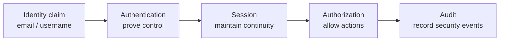
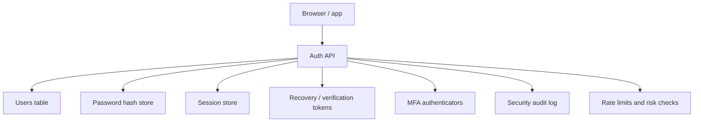
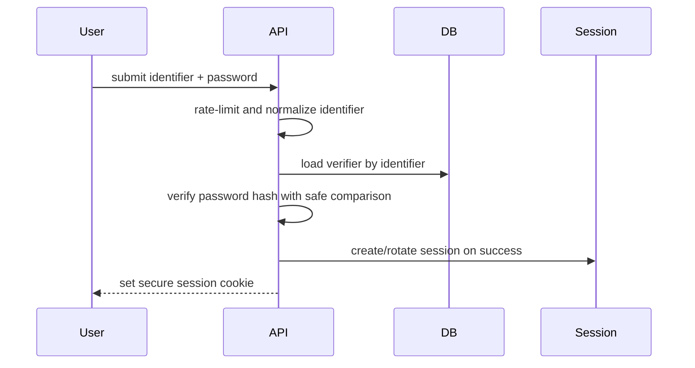

# Authentication System Design Best Practices

## Purpose

Use this reference when deciding whether to build a custom authentication system or when reviewing one. Building auth yourself is not just "hash a password and issue a JWT." It is a security-sensitive system that includes credential storage, identity verification, session lifecycle, recovery flows, MFA, abuse protection, auditability, and operational response.

Default recommendation: use a mature authentication provider unless there is a clear product, compliance, deployment, or platform reason to own auth directly. If you build it, treat it as critical security infrastructure.

## Decision Summary

| Decision | Default Practice | Why It Matters |
| -------- | ---------------- | -------------- |
| Build vs buy | Prefer a proven provider for most products | Auth mistakes create account takeover and data exposure risk |
| Password storage | Use Argon2id, bcrypt, scrypt, or PBKDF2 with per-password salts | Plain or fast hashes are unsafe after database compromise |
| Sessions | Prefer opaque server-side session ids in secure cookies for browser apps | Easier revocation and less token exposure to JavaScript |
| JWTs | Use short-lived access tokens and a controlled refresh flow | Long-lived bearer tokens are hard to revoke |
| Cookie security | Use `HttpOnly`, `Secure`, and appropriate `SameSite` | Reduces XSS token theft and CSRF risk |
| Password reset | Use random, single-use, expiring tokens and consistent responses | Reset flows are common account-takeover paths |
| MFA | Support stronger authenticators for sensitive accounts | Passwords are not phishing-resistant |
| Abuse protection | Rate-limit login, reset, MFA, and token endpoints | Prevents brute force, credential stuffing, and mail abuse |
| Logging | Audit security events without logging secrets | Enables incident response without leaking credentials |

## When To Build Auth Yourself

Consider a custom auth system only when:

- the product has constraints a provider cannot meet;
- deployment must run fully self-hosted or offline;
- compliance requires direct control of identity lifecycle;
- the team has security ownership and operational capacity;
- authentication is part of the product's core platform.

Avoid custom auth when:

- the main goal is speed;
- the team lacks security review capacity;
- the app needs enterprise SSO, passkeys, MFA recovery, device management, and audit logs soon;
- the implementation is being generated quickly by an AI agent without a security test plan.

## Mental Model

Authentication proves the user controls one or more authenticators. Authorization decides what that authenticated user can do. Session management preserves authenticated state across requests.



Do not mix these responsibilities. A valid session proves identity continuity; it does not automatically grant access to every resource.

## Recommended Architecture



Keep secrets and verifier data server-side. The client should receive only what it needs to continue a session safely.

## Password Registration And Login

Use email or username consistently. Avoid exposing whether an account exists through different messages, timing, or status behavior.

Password rules:

- allow long passwords and passphrases;
- allow copy/paste and password managers;
- avoid arbitrary composition rules such as "must include uppercase, number, and symbol";
- block common or known-compromised passwords when feasible;
- do not silently truncate passwords;
- transmit credentials only over HTTPS;
- require re-authentication for sensitive operations.

Login flow:



## Password Storage

Never store plaintext passwords. Never use fast general-purpose hashes such as raw SHA-256 for password storage.

Recommended algorithms:

- Argon2id;
- bcrypt;
- scrypt;
- PBKDF2 when required by platform or compliance constraints.

Store:

- algorithm name;
- algorithm parameters;
- unique salt;
- password hash;
- creation/update timestamps.

This allows future migration when parameters or algorithms need upgrading.

Example conceptual shape:

```text
password_hash = argon2id(password, unique_salt, memory, iterations, parallelism)
stored_record = algorithm + parameters + salt + hash
```

Use constant-time or framework-provided safe comparison helpers when checking hashes.

## Session Management

For browser applications, prefer opaque session ids stored in secure cookies unless there is a clear reason to use bearer tokens directly.

Cookie baseline:

```http
Set-Cookie: __Host-session=<opaque-random-id>; Path=/; Secure; HttpOnly; SameSite=Lax
```

Use:

- `HttpOnly` to block JavaScript access;
- `Secure` to require HTTPS;
- `SameSite=Lax` or `SameSite=Strict` depending on product flows;
- `SameSite=None; Secure` only when cross-site cookies are required;
- `__Host-` prefix when possible to restrict domain/path scope.

Session rules:

- generate session ids with a cryptographically secure random generator;
- rotate session ids after login and privilege changes;
- set idle and absolute expiration;
- support logout and server-side invalidation;
- store session state server-side;
- expose active sessions to users when useful;
- allow users to revoke other sessions.

## JWT And Refresh Tokens

JWTs are signed claims, not magic sessions. Treat them as bearer credentials: anyone holding a valid token can use it until it expires or is rejected.

Use JWTs when:

- APIs need stateless short-lived access tokens;
- services need signed claims without a central session lookup;
- mobile/native clients need explicit token exchange flows.

Avoid:

- long-lived access tokens;
- storing high-value tokens in browser `localStorage`;
- putting sensitive data in JWT payloads;
- relying on JWT claims after permissions change unless token refresh/revocation is handled.

Refresh token pattern:

- short-lived access token;
- longer-lived refresh token stored securely;
- rotation on use;
- reuse detection;
- revocation on logout, password reset, suspicious activity, or account compromise.

## Account Recovery

Password reset is an authentication flow, not a convenience endpoint.

Recommended reset flow:

1. User submits email/identifier.
2. API always returns a consistent response.
3. If the account exists, API creates a random, single-use, expiring reset token.
4. API stores only a hash of the token.
5. User receives a reset link through a side channel such as email.
6. User submits a new password with the token.
7. API verifies token hash, expiry, and single-use state.
8. API updates the password hash.
9. API invalidates existing sessions or asks the user whether to do so.
10. API sends a notification that the password changed.

Do not automatically log the user in after password reset unless the system has a deliberate, reviewed reason.

Avoid security questions as the only recovery mechanism. They are often guessable, reused, or discoverable.

## Email Verification And Identity Changes

Email verification proves control of an email inbox at a point in time. It is not a proof of legal identity.

Use verification for:

- activating accounts;
- changing email addresses;
- reducing typo and deliverability issues;
- gating sensitive product behavior.

For email changes:

- notify the old address;
- verify the new address;
- require recent authentication for sensitive accounts;
- invalidate or review sessions after suspicious changes.

## MFA And Step-Up Authentication

MFA reduces password-only risk, but recovery and enrollment flows become sensitive.

Prefer stronger factors:

- WebAuthn/passkeys/security keys for phishing resistance;
- TOTP as a broadly compatible option;
- recovery codes stored hashed server-side;
- backup factors with clear lifecycle management.

Require step-up authentication for sensitive actions:

- changing password or email;
- managing MFA;
- exporting sensitive data;
- changing billing/security settings;
- creating API keys;
- deleting accounts.

## Abuse Protection

Protect every authentication-adjacent endpoint:

- login;
- registration;
- password reset request;
- reset token submission;
- email verification;
- MFA verification;
- refresh token exchange;
- resend email/code endpoints.

Controls:

- IP and account-based rate limits;
- progressive delays;
- bot detection or CAPTCHA only when justified;
- breached password checks;
- credential stuffing detection;
- uniform messages and timing where account enumeration is possible;
- alerts for suspicious account activity.

Avoid account lockout policies that let attackers deny access to known users. Prefer throttling and risk-based controls.

## Operational Controls

Log security events:

- login success/failure;
- logout;
- password change;
- password reset requested/completed;
- email change;
- MFA enrolled/removed/used;
- session revoked;
- suspicious token reuse;
- admin impersonation or privileged access.

Do not log:

- passwords;
- password reset tokens;
- session ids;
- refresh tokens;
- MFA codes;
- full authorization headers.

Operational requirements:

- secret rotation process;
- incident response path for token/key compromise;
- database backup protection;
- monitoring for spikes in failures/resets;
- admin access controls;
- migration plan for password hash upgrades.

## Validation

Test at least:

- registration rejects weak or breached passwords;
- duplicate identifiers do not reveal account existence more than intended;
- login uses rate limits and safe password verification;
- session cookie has `HttpOnly`, `Secure`, `SameSite`, and appropriate scope;
- session id rotates on login;
- logout invalidates the server-side session;
- password reset token is random, single-use, expiring, and stored hashed;
- password reset does not reveal whether an account exists;
- changing password invalidates existing sessions when required;
- JWT access tokens expire quickly;
- refresh token rotation and reuse detection work;
- MFA setup, verification, recovery, and removal require appropriate checks;
- sensitive actions require recent authentication or step-up auth;
- audit logs capture events without secrets.

## Anti-Patterns

| Anti-pattern | Problem | Alternative |
| ------------ | ------- | ----------- |
| Plaintext passwords | Total compromise after database leak | Slow salted password hashing |
| SHA-256 password hashes | Too fast for offline cracking | Argon2id, bcrypt, scrypt, or PBKDF2 |
| JWTs that never expire | Hard to revoke after theft | Short-lived access tokens + refresh rotation |
| Tokens in `localStorage` by default | XSS can steal bearer credentials | Secure HttpOnly cookies or carefully scoped token storage |
| Password reset token stored plaintext | Database leak enables account takeover | Store a hash of the reset token |
| Different reset messages for known/unknown emails | Account enumeration | Consistent response and timing |
| No rate limiting | Brute force and credential stuffing | Layered IP/account/device limits |
| Security questions as sole recovery | Answers are guessable or discoverable | Random reset tokens, MFA recovery codes, stronger recovery flows |
| No session invalidation | Stolen sessions survive password changes | Revoke sessions on sensitive events |
| Logging secrets | Logs become credential stores | Redact tokens, passwords, cookies, and auth headers |

## Checklist

- [ ] Decide build vs buy explicitly.
- [ ] Separate authentication, authorization, and session management responsibilities.
- [ ] Store passwords with a slow salted password hashing algorithm.
- [ ] Store password hash parameters for future migration.
- [ ] Use HTTPS everywhere.
- [ ] Use secure cookies for browser sessions when possible.
- [ ] Rotate session ids after login and privilege changes.
- [ ] Implement idle and absolute session expiration.
- [ ] Support logout and server-side session invalidation.
- [ ] Use short-lived JWT access tokens if JWTs are required.
- [ ] Rotate refresh tokens and detect reuse.
- [ ] Implement secure password reset.
- [ ] Avoid account enumeration in login/reset flows.
- [ ] Add rate limits to auth endpoints.
- [ ] Support MFA for sensitive accounts.
- [ ] Require step-up auth for sensitive actions.
- [ ] Log security events without secrets.
- [ ] Test recovery, revocation, and abuse cases.

## References

- [OWASP: Authentication Cheat Sheet](https://cheatsheetseries.owasp.org/cheatsheets/Authentication_Cheat_Sheet.html)
- [OWASP: Password Storage Cheat Sheet](https://cheatsheetseries.owasp.org/cheatsheets/Password_Storage_Cheat_Sheet.html)
- [OWASP: Session Management Cheat Sheet](https://cheatsheetseries.owasp.org/cheatsheets/Session_Management_Cheat_Sheet.html)
- [OWASP: Forgot Password Cheat Sheet](https://cheatsheetseries.owasp.org/cheatsheets/Forgot_Password_Cheat_Sheet.html)
- [NIST SP 800-63B: Authentication and Lifecycle Management](https://pages.nist.gov/800-63-4/sp800-63b.html)
- [MDN: Set-Cookie Header](https://developer.mozilla.org/en-US/docs/Web/HTTP/Reference/Headers/Set-Cookie)
- [MDN: Using HTTP Cookies](https://developer.mozilla.org/en-US/docs/Web/HTTP/Guides/Cookies)

## Source Inspiration

This guide was inspired by:

- Repeated implementation and review failures in custom authentication systems where the login screen worked, but password storage, sessions, recovery, token lifecycle, or abuse controls were incomplete.
